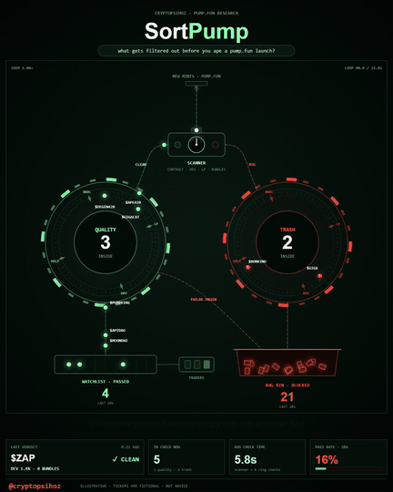
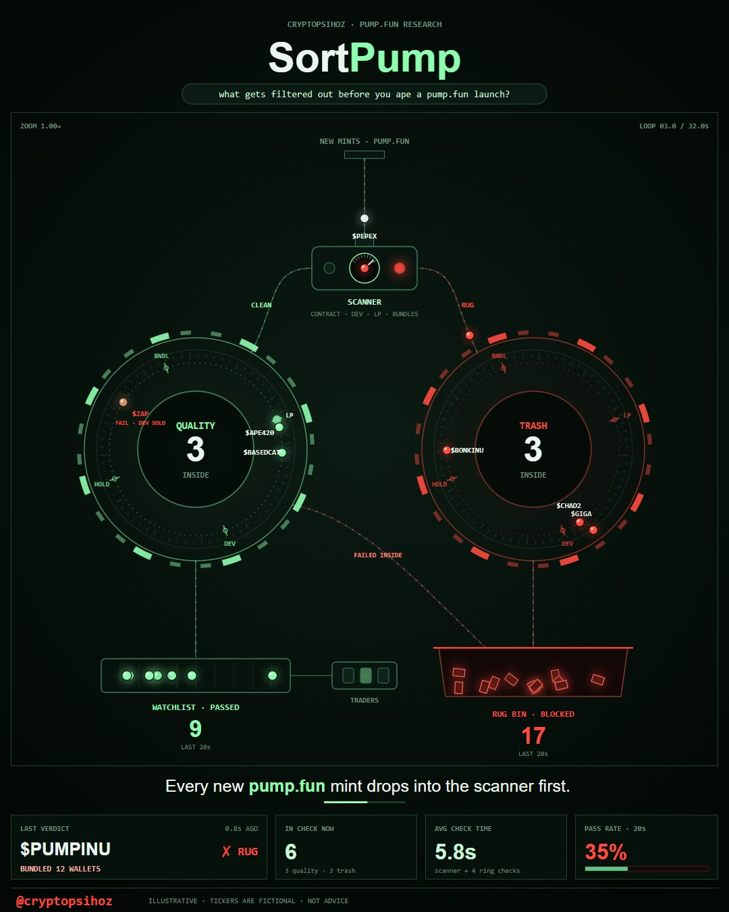
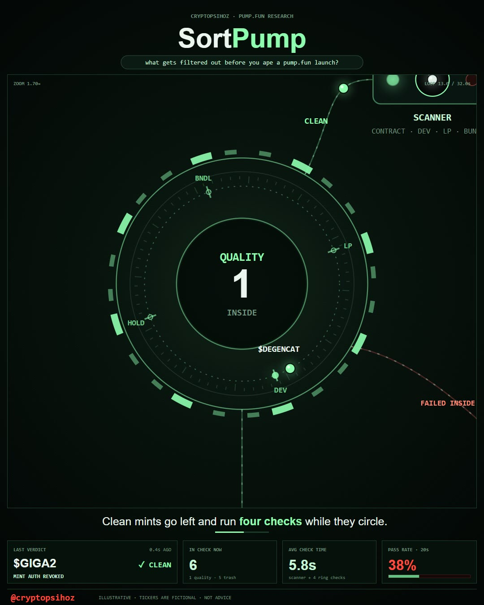
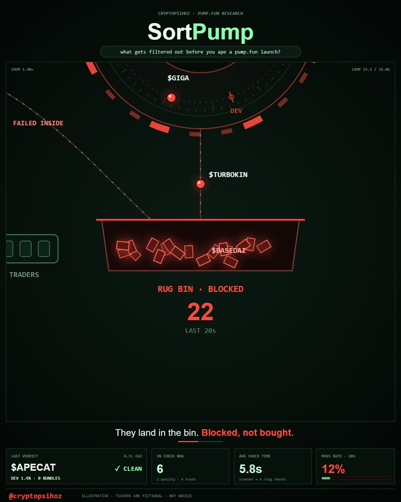

# SortPump

**A real-time visual sorter for pump.fun launches: every new mint is scanned, routed into a QUALITY or TRASH ring, run through on-chain checks and delivered either to the watchlist or to the rug bin.**

by [@cryptopsihoz](https://x.com/cryptopsihoz) · [Live demo](https://rimtoln.github.io/cryptopsihoz-sortpump/) · [Full video (MP4)](media/sortpump-overview.mp4)

## Video overview

[](media/sortpump-overview.mp4)

*The preview plays inline. Click it for the full 1080×1350 video (32 s, 30 fps).*

---

## Why SortPump

Thousands of tokens launch on pump.fun every day, and most of them are built to drain buyers: the dev holds a third of the supply, wallets are bundled, mint authority is still live, liquidity is not burned. SortPump turns the filtering pipeline into one clear animated scene, so anyone can see in 30 seconds what gets cut before a buy and why one scan is not enough.

It ships as a single HTML file, so you can open it in a browser, record it, post it, or put it on a stream.

## How the pipeline works

1. **NEW MINTS · PUMP.FUN.** A fresh mint drops into the scanner every 0.8 s.
2. **SCANNER.** Reads the contract: dev share, LP, bundles and mint authority. The needle swings left to CLEAN or right to RUG.
3. **QUALITY ring.** Clean mints orbit through four checks: `LP · DEV · HOLD · BNDL`. The `INSIDE` counter shows how many are being checked right now.
4. **TRASH ring.** Rugs are routed to the red ring.
5. **FAILED INSIDE.** Some mints pass the scanner but turn red mid-check (`FAIL · DEV SOLD`) and are ejected to the bin. This is the key point: the first filter is not enough.
6. **WATCHLIST · PASSED → TRADERS.** Only mints that pass every check reach the traders.
7. **RUG BIN · BLOCKED.** Blocked mints drop into the bin and dissolve.

| Overview | QUALITY ring | RUG BIN |
|---|---|---|
|  |  |  |

## Features

- Scripted camera with 6 shots: overview, scanner, QUALITY ring, TRASH ring, rug bin, back to overview.
- 6 on-screen captions with highlighted keywords and a progress bar.
- 4 live stat panels: LAST VERDICT, IN CHECK NOW, AVG CHECK TIME, PASS RATE · 20s.
- Deterministic token stream, so every playback and every recording is identical.
- Seamless 32 s loop: the last frame flows into the first with no jump.
- Sharp on any screen: respects `devicePixelRatio` up to 3×.
- Zero dependencies: one HTML file that works offline.

## Specs

| | |
|---|---|
| Loop | 32 s, seamless |
| Mints per loop | 40 |
| Trash share | ~64% |
| Fail inside | ~30% of scanner passes |
| Checks per ring | 4 |
| Camera shots | 6 |
| Frame | 1080×1350 (4:5) |
| Performance | 60 fps, ~0.6 ms per frame |
| Dependencies | none |

## Quick start

- **Online:** open **https://rimtoln.github.io/cryptopsihoz-sortpump/**
- **Offline:** download `index.html` and double-click it.

**Controls:** `Space` pauses, `F` toggles fullscreen. On a 1920×1080 monitor the fullscreen frame is 864×1080, centered at x 528–1392.

## Record your own video

There are two ways to record, both described step by step in **[docs/RECORDING.md](docs/RECORDING.md)**:

1. **Screen recording (OBS, 5 minutes).** Open the demo, press `F`, record one 32 s loop.
2. **Frame-perfect render (Python + ffmpeg).** Renders all 960 frames at exactly 1080×1350 and encodes MP4 and GIF. This is how the video above was made.

## Project structure

```
index.html                 the app (same file as the live demo)
versions/SORTPUMP-v01.html frozen releases
media/                     overview video, preview GIF, stills
docs/HOW-IT-WORKS.md       timing, token routing, camera, panels
docs/CUSTOMIZE.md          constants to change tickers, odds, camera, captions, colors
docs/RECORDING.md          how to record the video yourself
tools/capture/             capture server and browser script
CHANGELOG.md
LICENSE
```

## Documentation

- [How it works](docs/HOW-IT-WORKS.md)
- [Customize](docs/CUSTOMIZE.md)
- [Record your own video](docs/RECORDING.md)

## License

[MIT](LICENSE)
